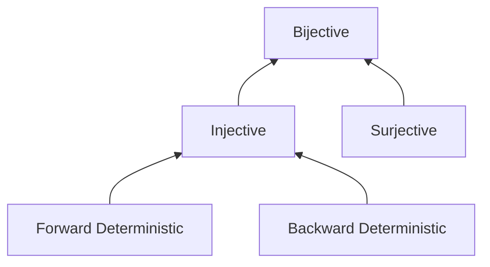
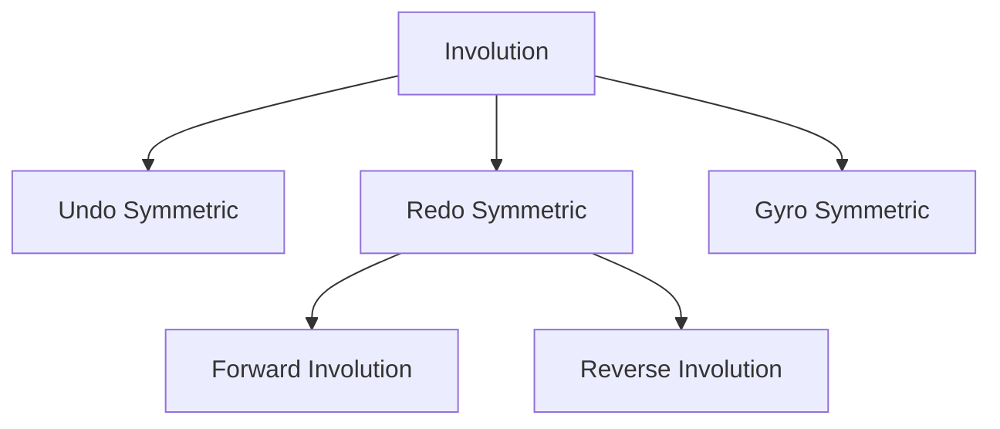

In part 1 of the discussion of symmetry-breaking, we discussed what
symmetry-breaking was, the motivating problems that necessitated the
introduction of symmetry-breaking, and many of the basic primitives that can be
used to build symmetry-breaking code. However, we were left with an unwieldy
tool that broke all of the patterns that we had previously established. In this
sixth post on reversible programming, we will discuss the problems that
symmetry-breaking has left us with, a more precise model of how reversible
functions can be structured, and a substitute for undo symmetry that can salvage
our existing patterns for use in symmetry-breaking code.
<!--more-->
<script type="text/javascript" async src="https://cdn.jsdelivr.net/npm/mathjax@3/es5/tex-mml-chtml.js"></script>

#### A Disclaimer on Syntax

The code examples in this series use C-like imperative pseudocode. New
reversible programming primitives will be given distinct syntax and keywords
from the non-reversible primitives that they displace-- even if their
functionality is nearly identical-- because the existing non-reversible
primitives are still used throughout these posts to provide contrasting examples
or to make the behavior of reversible primitives explicit by giving concrete
implementations.

This syntax is also distinct from the syntax of existing reversible programming
languages, which often choose to reuse the syntax and keywords of non-reversible
programming languages for corresponding-but-not-equivalent concepts.

## Cleaning Up After Symmetry-Breaking Functions

In the previous post, we discovered that all of the functions we had been
dealing with up to that point in the series had a property called ["undo symmetry"](/post/2026/02/18/reversible-primer-symmetry-breaking/#undo-symmetry),
and this symmetry was the source of a lot of those functions' nice properties.
One of the most important properties of undo symmetric functions is that we can
clean up the results of running an undo symmetric function by just running it a
second time in reverse.

In some special cases, such as the `forward_half_toggle` and `reverse_half_toggle`
[discussed in the previous post](/post/2026/02/18/reversible-primer-symmetry-breaking/#forward_half_toggle--reverse_half_toggle),
symmetry-breaking functions can have similarly simple cleanup methods. For
`forward_half_toggle` and `reverse_half_toggle`, we can clean up their results
by just running them a second time in the *same* direction. However, in the
general case of symmetry-breaking code, cleaning up after the results of running
the code is much less straightforward.

For example, consider the following code snippet:

```rust
fdo {
  list.push("Executed forward");
}
rdo {
  // Remember from the last post, that we can wrap the contents of an `rdo`
  // block in `undo` to make it execute as-written when code is executed
  // in-reverse.
  undo {
    list.push("Executed reverse");
  }
}
```

Regardless of the direction this code snippet is executed, it results in a value
being pushed into `list`. Run as-is, it pushes the string `"Executed forward"`.
But if we were to run it in an `undo` block:

```rust
undo {
  fdo {
    list.push("Executed forward");
  }
  rdo {
    undo {
      list.push("Executed reverse");
    }
  }
}
```

it would push the string `"Executed reverse"`.

In this case, we can just look at the code and easily deduce how to clean up
after it. We can trivially just swap the `undo` into the other block, and
execute that:

```rust
fdo {
  undo {
    list.push("Executed forward");
  }
}
rdo {
  list.push("Executed reverse");
}
```

However, we won't always have the ability to inspect the implementation of code
like this; often we will be invoking code by calling a function and may not have
access to the function's definition. Plus, we ideally do not want to have to
manually invert each piece of code to clean it up. The ability to automatically
clean up after arbitrary code was what made Lecerf-Bennett Reversal so
important, after all.

Moreover, [the motivating example for symmetry-breaking](/post/2026/02/18/reversible-primer-symmetry-breaking/#reversible-user-input)--
reading user input-- is an example of a type of code that outputs a result that
we simply *cannot* clean up at all, by the nature of reversible programming
languages.

This code example is a bit contrived, but it raises the question of how difficult
it will actually be to wrangle examples of symmetry-breaking code encountered
"in the wild", in external dependencies that the programmer doesn't have control
over or the ability to examine the source code of. If symmetry-breaking breaks
all of our patterns, then are there any new patterns that we can rely on to make
symmetry-breaking comprehensible? And without undo symmetry, what is even our
foundation for the behavior of reversible code?

Up until this point, undo symmetry served as the intuitive litmus test for
whether or not code was reversible, even though we didn't really recognize that
the symmetry even existed until after we had already broken it. Without being
able to run code backwards to "undo" it, it's a little harder to feel sure that
what's happening in the code *is* reversible. What we really need is a new
way of reasoning about what kinds of patterns are actually possible in
reversible code.

## Bifunctions

With `fdo` and `rdo`, we have basically reached a point where the behavior of a
function can be broken into two entirely independent functions defining its
forward and reverse behaviors. We can write this kind of code in a fully general
form as follows:

```rust
fdo {
  f();
}
rdo {
  // For simplicity, we'll wrap the body in `undo` so that it executes
  // as-written.
  undo {
    r();
  }
}
```

Here, `f` and `r` are the independent forward and reverse behaviors of the
function. When this snippet is executed forward, `f()` is called, and when it is
executed in reverse, `r()` is called.

Writing out this entire sequence of nested control structures with function
calls in them is a little cumbersome. In this section, we are going to be making
a lot of statements about this structure and giving a lot of examples, so, just
for this section, it would be helpful to adopt a more concise shorthand. In the
examples that follow, we will represent a code snippet that runs `f` when
executed forward and `r` when executed in reverse as:

$$
[f, r]
$$

Since our code snippet is really composed of two different functions, it might
make more sense to think of it as something other than a function. We might
think of it as a "bifunction" instead, since it's made up of a pair of
functions.

We can call a bifunction, which just results in the first function in the pair
being called:

$$
[f, r]() = f()
$$

This is equivalent to running the above code snippet forward, as both just
result in a call to `f()`.

If we want to be able to call `r()`, we can "reverse" the bifunction, which
swaps the two bifunctions in the pair:

$$
[f, r]^T = [r, f]
$$

This uses the "[transposition](https://en.wikipedia.org/wiki/Transpose)" syntax,
since it is literally "transposing" (or "swapping") the two functions.
Transposing the bifunction is equivalent to wrapping the entire code snippet in
an `undo` statement:


```rust
undo {
  fdo {
    f();
  }
  rdo {
    undo {
      r();
    }
  }
}
```

If we want to call `r()`, we can transpose the bifunction and then call it,
which is equivalent to wrapping the structure in an `undo` block then executing
it forward:

$$
[f, r]^T() = [r, f]() = r()
$$

But, when we talk about "cleanup", what we really want are the "inverses" of `f`
and `r`. For the sake of discussion, we can represent this "true inverse" of a
bifunction as:

$$
[f, r]^{-1} = [f^{-1}, r^{-1}]
$$

Inverting a bifunction replaces each of its constituent functions with their
inverses. This produces a new bifunction where each direction truly "undoes" the
results of one of the directions of the original bifunction. This operation is
**not available** in reversible programming languages, but it's useful to be
able to clearly represent the inverse.

So, how can we make sense of these two different forms of "inversion"? As with
previous difficult control flow concepts, it might be helpful to return to the
railroad analogies that we've used previously.

Executing $$f$$ would be equivalent to traveling in one direction down the
track:

$$
[f, r]()
$$

{:style="display:block; margin-left:auto; margin-right:auto"}

Executing $$r$$ by transposing the bifunction would be equivalent to traveling
in the opposite direction down the same track, which takes you in the opposite
direction:

$$
[f, r]^T()
$$

{:style="display:block; margin-left:auto; margin-right:auto"}

This is clearly going in the opposite direction, and if the train was hauling
back the same cargo, it might even be accomplishing the inverse of the train
headed right, but is clearly not being "rewound", as the train is facing the
opposite direction.

On the other hand, executing the inverse of $$f$$ by inverting the bifunction-- which truly
undoes the behavior of $$f$$-- would be equivalent to **backing up**
along the track, backing away from the destination that was reached by
traveling forward.

$$
[f, r]^{-1}()
$$

{:style="display:block; margin-left:auto; margin-right:auto"}

This is a "true rewind" of the behavior of $$[f, r]()$$.

And finally, we can combine the two, and execute the inverse of $$r$$ by both
transposing and inverting the bifunction-- which truly undoes the behavior of
$$r$$. This would be equivalent to backing away from the destination that was
reached by traveling in in the opposite direction.

$$
[f, r]^{-T}()
$$

{:style="display:block; margin-left:auto; margin-right:auto"}

Ordinary non-reversible code can only be executed in one direction, and the
pitch for reversible code is that the code can be executed in two directions,
which are generally suggested to be $$[f, r]$$ and $$[f, r]^{-1}$$. However,
we've just described four different "directions" of reversible code execution
(if we can stretch the definition of "direction" a bit).

With this four "direction" model, it becomes clear, that reversible programs
only have access to $$[f, r]$$ and $$[f, r]^{T}$$, while the
"backing up"/"rewind" directions, $$[f, r]^{-1}$$ and $$[f, r]^{-T}$$, are not
accessible during normal code execution, even though their behavior is
well-defined. The reason for this mismatch is because of the implicit assumption
baked into most discussions of reversible computing that all reversible code is
undo symmetric. Under this model, undo symmetric code can be always be written
as a bifunction of the form:

$$
[f, f^{-1}]
$$

In other words, undo symmetric bifunctions have the property that the two
functions that make up the bifunction are inverses of one another. As a result,
transposition and inversion are equivalent when applied to undo symmetric
bifunctions:

$$
\begin{align*}
[f, f^{-1}]^T &= [f^{-1}, f] \\
[f, f^{-1}]^{-1} &= [f^{-1}, f]
\end{align*}
$$

As a result, if you were not aware that reversible bifunctions existed that were
not undo symmetric, you would be under the impression that inversion was readily
available, because you would think that transposition and inversion were simply
the same thing.

But, there's one remaining question for this model. If you remember from the
[previous post](/post/2026/02/18/reversible-primer-symmetry-breaking/#reversible-user-input),
we determined that the inverse of reading user input cannot exist in a
reversible programming language, and this is why reading user input cannot be
undo symmetric. In otherwise, for a $$readline$$ function that reads user input,
we cannot construct a bifunction $$[readline, readline^{-1}]$$. This means that
there are restrictions on what kinds of functions are allowed to be part of a
reversible bifunction.

If that restriction excludes I/O functions-- or any other functions that are
necessary for practical user-facing applications-- then we're going to have
difficulty accomplishing much of value in a reversible programming language.

Luckily, the constraint turns out to be fairly flexible, and offers enough
wiggle room for I/O and other important features: we just need these functions
to be backward deterministic.

### Forward and Backward Determinism

It's typical to think of the functions or instructions of a reversible
programming language as [injective functions](https://en.wikipedia.org/wiki/Injective_function)
over program states, that map in a 1:1 fashion from an input program state to
an output program state. If we restrict ourselves to injective functions only,
then reading user input is forbidden from the outset, because reading user input
is non-injective-- it maps a single initial input state to one of several
possible resulting output states depending on what the user's input actually
was. Luckily, we can make our criteria more lenient, by breaking "injectivity"
down further into two constituent properties: "forward determinism" and
"backward determinism".

- A function is "forward deterministic" if, for each input, there is exactly one
  possible output (In true mathematical terms, functions that violate forward
  determinism are instead called "relations", but we'll continue to call them
  "functions", because the idea of things like "random functions" that return
  one of several results non-deterministically is well understood in computer
  programming).
- A function is "backward deterministic" if, for each possible output, there is
  exactly one possible input that can produce that output.

A function that is both forward deterministic and backward deterministic must
also be injective, because if each input can only produce one output, and each
output can only be produced by one input, the function must be a 1:1 mapping.
This slots forward and backward determinism into the bottom level of the
hierarchy of properties that make up "[bijectivity](https://en.wikipedia.org/wiki/Bijection)":



For the purpose of our bifunction model, our only criteria is that the two
members of a bifunction must each be individually backward deterministic.
Backward determinism is the minimum possible requirement for a function $$f$$,
that ensures that $$f^{-1}(f(x)) = x$$-- or in other words, it is the minimum
property that ensures that, given the result of evaluating a function, it is
always possible to recover the original input prior to the function being
evaluated. This is because, if $$f$$ is a backward deterministic function,
then $$f^{-1}$$ must be a forward deterministic function that maps all of the
possible outputs of $$f$$ back to the initial input that produced them. The fact
that there is always a way to retrieve the initial input state that produced
each output state means that no information is being lost.

Note that the ordering of the composition above is specific, and does not
necessarily work the other way. It is not necessarily true for a given backward
deterministic function $$f$$ that $$f(f^{-1}(x)) = x$$ in all cases. For a
common example from the world of mathematics, just consider squaring a number,
and its inverse, taking the square root. Let's define a squaring function,
$$square(x) = x^{2}$$, with its inverse being the well-known square root: $$sqrt(x)$$.
$$sqrt(x)$$ is a backward deterministic function, and thus it is always true
that $$square(sqrt(x)) = x$$. However, it is not always true that
$$sqrt(square(x)) = x$$. For example, when $$x = -2$$.

$$
sqrt(square(-2)) = sqrt(4) = 2
$$

As you may have guessed, reading user input (or any other form of I/O, for that
matter) is not forward deterministic, because it can produce multiple possible
values, but it *is* backward deterministic-- or at least, you can specify I/O
primitives in a backward deterministic way. For example, we can return to that
[original motivating example for symmetry-breaking](/post/2026/02/18/reversible-primer-symmetry-breaking/#reversible-user-input):

```rust
string text <- readline();
```

This statement for reading user input can be specified as a bifunction,
$$[readline, r]$$, where `readline` and `r` are each independent backward
deterministic functions.

The fact that `readline` is backward deterministic but not forward deterministic
confirms our reasoning in the previous post that the inverse of `readline` does
not exist in reversible programming languages, and that the output of `readline`
cannot be cleaned up. However, this critical distinction between injective
functions and backward deterministic functions also provides the seam that we
can use to get ahold of and wrangle a huge and useful subset of
symmetry-breaking code.

It is true that functions that lack forward determinism, like `readline` can
only be exposed to reversible programming languages as symmetry-breaking
bifunctions. However, the inverse is not true. It is not true that every
symmetry-breaking bifunction is composed of individual functions that lack
forward determinism. By exploiting the fact that most symmetry-breaking
primitives **do** have forward determinism and **can** be undone, we can develop
a new kind of pattern for writing symmetry-breaking code that makes it
significantly easier to work with.

## Undo Pseudosymmetry

As discussed in [the first section](#cleaning-up-after-symmetry-breaking-functions),
symmetry-breaking code does not play nicely with the patterns we've introduced
in past posts for cleaning up after running code. We could not safely include
symmetry-breaking code in a [`flash` block](/post/2025/11/24/reversible-primer-control-backtrack/#flash),
for example, because `flash` blocks and other cleanup methods implicitly assume
that the code being cleaned up possesses undo symmetry.

But, what if it were possible to have our cake and eat it too? What if we could
write code that broke undo symmetry, allowing it to accomplish totally new
things that cannot be accomplished without breaking undo symmetry, but that code
was also cleverly disguised so that from the perspective of things like `flash`
blocks, it seemed to behave as if it had undo symmetry?

In [the section about undo symmetry](/post/2026/02/18/reversible-primer-symmetry-breaking/#undo-symmetry), undo symmetry was
informally defined as a property of any function `f` for which the following
program:

```rust
f();
undo {
  f();
}
```

Results in no net change to the program state.

So, returning to the question from above: is it possible for code that
internally breaks symmetry to have this property?

The answer is: yes.

In the [previous post](/post/2026/02/18/reversible-primer-symmetry-breaking/#forward_half_toggle--reverse_half_toggle),
we discussed how `forward_half_toggle` and `reverse_half_toggle` together make a
"whole" toggle.

```rust
forward_half_toggle(&boolean_variable);
reverse_half_toggle(&boolean_variable);

// Is equivalent to:

!@boolean_variable;
```

Since toggling a boolean is undo symmetric, this sequence of half-toggles
satisfies the undo symmetry property:

```rust
// This pair toggles the boolean when executed forward.
forward_half_toggle(&boolean_variable);
reverse_half_toggle(&boolean_variable);
undo {
  // This pair toggles the boolean back to its initial value when executed in reverse.
  forward_half_toggle(&boolean_variable);
  reverse_half_toggle(&boolean_variable);
}
```

So, there is definitely code that internally breaks symmetry, but behaves as if
it had undo symmetry. We could say that such code has "undo pseudosymmetry"; if
its individual operations were carefully observed, it would be clear that the
code is actually doing different things when run forward or in reverse, but at
the granularity of the entire code snippet, the code performs the exact inverse
behavior when run in reverse.

However, this is obviously an extremely trivial example. Using symmetry-breaking
primitives to implement existing undo symmetric primitives doesn't allow you to
do anything new. But, as it turns out, there are non-trivial code structures
that internally break symmetry to accomplish things that could not be
accomplished without breaking symmetry, that nonetheless have undo
pseudosymmetry.

### `clutch`

In a [previous post on backtracking](/post/2025/11/24/reversible-primer-control-backtrack/#toggle-reflectors-and-backtracking),
we examined an application of backtracking as a form of error handling, where
errors were handled by toggling an error flag and initiating backtracking.

```rust
bool error_encountered <- false;
bool handling_error <- false;

// On our first pass, this `given` statement will be skipped.
given(error_encountered) {
  // This toggle reflector terminates the backtracking
  // initiated by the error condition later in the program
  // and sets the `handling_error` flag.
  turn(handling_error) {
    !@handling_error;
  }
}

// Pre-backtracking we enter the `do_some_work` block.
// Post-backtracking, we enter the `handle_error` block.
given(!handling_error) {
  do_some_work();

  // Whoops, we encountered an error-- let's set the
  // `error_encountered` flag and initiate backtracking.
  given(some_error_condition) {
    turn(error_encountered) {
      !@error_encountered;
    }
  }
} else {
  handle_error();
}
```

Here, when an error occurs, we flip the `error_encountered` flag and initiate
backtracking. The guard statement prior to the erroring code is able to detect
this error flag and recover from the backtracking.

This is all well and good as long as you know ahead of time exactly what error
flags the code you are calling into is going to set. However, what if you know
that the code might initiate backtracking, but you do not know-- or do not have
access to-- the error flags that the code is going to set? It seems like
interrupting the backtracking would become **impossible**.

This is where a new control structure can come in clutch: the `clutch`
statement.

We can implement the `clutch` statement as follows:

```rust
clutch(&condition_variable) {
  // body
}

// Is equivalent to:

bool temp -< condition_variable;
turn(temp) {
  reverse_half_toggle(&temp);

  // body

  reverse_half_toggle(&temp);
}
temp >- condition_variable;
```

`temp` here is a hidden temporary variable that only the `clutch` statement can
access. Unlike the control structures introduced in previous posts, `clutch`
does not accept a `condition` expression, and instead accepts a reference (`&`)
to a `condition_variable`.

With both `turn` statements and symmetry-breaking in its implementation, the
`clutch` statement may seem intimidating, but its behavior is actually pretty
simple.

- Like a `turn` statement, the `clutch` statement initially begins executing its
  block forward if `condition_variable` is `false`, and in reverse if
  `condition_variable` is `true`.
- However, when the `clutch` statement exits, code always resumes executing in
  the same direction it was executing before the `clutch` statement began,
  regardless of what direction the block was executed and whether or not the
  block initiated backtracking.
- However, if the block initiated backtracking and exited in the opposite of the
  direction it was entered, the `condition_variable` will be toggled when the
  `clutch` statement completes.

`clutch` acts kind of like a "sandbox" for backtracking; it prevents
backtracking from leaking out of the `clutch` statement's block into the rest of
the program. Reversibility is maintained because the information about whether
or not backtracking occurred is persisted in the toggling of the boolean.

In [past](/post/2025/10/24/reversible-primer-control-basic/#between) [posts](/post/2025/11/24/reversible-primer-control-backtrack/#turn),
it has been helpful to use railroad analogies to help understand how some of the
more complex control structures work, and there's a pretty clean visual analogy
for a `clutch` statement, although it's a little more exotic than the previous
railway analogies.

<video autoplay loop muted playsinline style="max-width: 100%; height: auto;" aria-label="A train rolls onto a turntable with a complicated bending track on it that eventually loops back to its entrance. As the train travels through the winding track, the turntable automatically rotates so that the train's orientation never changes. Although the track on the turntable twists around to exit through the same track it was entered on, the turntables automatic rotation causes the train to exit moving in the same direction it was originally traveling on the opposite connecting track">
  <source src="/assets/images/clutch.mp4" type="video/mp4">
  Your browser doesn't support HTML5 video.
</video>

A `clutch` statement is essentially equivalent to a turntable that automatically
rotates to ensure that the train's absolute orientation remains the same at all
times while it is on the turntable. Because the train's orientation remains
constant, it is obvious that, regardless of what path it takes, the train must
exit on the opposite side of the turntable going forward.

Once the train leaves the turntable, the turntable is left in the exact same
state that it was in when the train rolled off, which is reflective of the
boolean `condition_variable` being toggled if the `clutch` statement block exits
in the opposite direction it was entered (though, in the animation above, for
the sake of looping, it flips back to the original side for the next iteration
of the animation).

Just as the "clutch" in a car disengages the engine from the transmission,
allowing them to rotate independently, the "`clutch` statement" disengages the
control flow within its block from the control flow of the program outside the
block, allowing the block to change direction independently of the rest of the
program.

With `clutch`, we can catch a wide range of errors at the same time without
needing to individually check the error flags for each of those errors:

```rust
bool backtracking_occurred <- false;

clutch(&backtracking_occurred) {
  // Backtracking can be initiated with any one of several error flags:
  given(condition_a) {
    turn(flag_a) {
      !@flag_a;
    }
  }

  given(condition_b) {
    turn(flag_b) {
      !@flag_b;
    }
  }

  given(condition_c) {
    turn(flag_c) {
      !@flag_c;
    }
  }
}
// `backtracking_occurred` will be toggled to `true` if backtracking occurred
// with *any* error flag.

given(backtracking_occurred) {
  perform_some_generic_error_recovery_procedure();
}
```

When the `clutch` body initiates backtracking, the `clutch` statement
"sandboxes" the backtracking and prevents it from propagating. Instead of
continuing to backtrack, the program instead proceeds onward to the following
`given` statement. Since the `clutch` statement will toggle the
`backtracking_occurred` flag when it recovers from backtracking, the `given`
statement will be entered and the cleanup code will be executed.

`clutch` can be used if you don't need to respond to the specific details of the
error, but you do need to run some sort of generic cleanup operation in any
circumstance where a particular code block raises an error.

#### Pseudosymmetry of `clutch`

So, the `clutch` statement solves a novel problem, but is it really
pseudosymmetric?

The key insight here is that for any specific code snippet implemented using
`clutch`, it is possible to write an exactly equivalent code snippet that does
not use `clutch`-- or any symmetry-breaking primitive-- but only by modifying
all of the locations within the block passed to the clutch statement that
potentially initiate backtracking.

```rust
bool backtracking_occurred <- false;

clutch(&backtracking_occurred) {
  given(condition_a) {
    turn(flag_a) {
      !@flag_a;
    }
  }

  given(condition_b) {
    turn(flag_b) {
      !@flag_b;
    }
  }

  given(condition_c) {
    turn(flag_c) {
      !@flag_c;
    }
  }
}

// Is equivalent to:

bool backtracking_occurred <- false;

turn(backtracking_occurred) {
  given(condition_a) {
    turn(flag_a) {
      !@flag_a;
      !@backtracking_occurred;
    }
  }

  given(condition_b) {
    turn(flag_b) {
      !@flag_b;
      !@backtracking_occurred;
    }
  }

  given(condition_c) {
    turn(flag_c) {
      !@flag_c;
      !@backtracking_occurred;
    }
  }
}
```

Here, rather than implicitly detecting whether or not backtracking occurred
using a symmetry-breaking primitive, we have each instance of backtracking
directly inform our simulated clutch statement that backtracking has occurred
by manually flipping the `backtracking_occurred` variable. (This is similar to
the method provided for emulating symmetry-breaking in an
[extra section of the previous post](/post/2026/02/18/reversible-primer-symmetry-breaking/#extra-simulating-symmetry-breaking)).

So, in theory, `clutch` *could* also be implemented as a sort of "macro" that
rewrites its block in this fashion, and the resulting rewritten code would not
break symmetry at all. However, such a macro would be fairly complex, because it
would also have to recursively write a new "signaling" version of every function
that is called from the block. The power of the `clutch` statement is that by
breaking symmetry, it is able to localize the concern of detecting backtracking
to only the location where you actually care about it-- the invocation of the
`clutch` statement itself-- without spreading that concern throughout the entire
codebase.

Because every `clutch` statement has an exact equivalent implementation that
does not break symmetry, `clutch` statements have undo pseudosymmetry.

### Implications of Pseudosymmetry

The upshot of pseudosymmetry is that `clutch` statements or other
pseudosymmetric code structures can be mixed in with ordinary undo symmetric
code under the patterns that we have been using up until now without issues.
Every pattern that symmetry-breaking destroys, pseudosymmetry restores.

As long as the contents of the `clutch` statement do not break undo symmetry
(or, are at least pseudosymmetric themselves), you can feel safe calling a
`clutch` statement in a `flash` block, or executing it backwards, sideways,
upside-down, what have you.

```rust
flash {
  bool error_occurred <- false;
  // the `error_occurred` flag preserves the information about how backtracking
  // should flow backwards through the `clutch` statement.
  clutch(&error_occurred) {
    some_func();
  }

  expose {
    given(error_occurred) {
      handle_error_result();
    } else {
      success_result();
    }
  }
}
```

This captures the general pattern of how symmetry-breaking can be used in a
reversible programming language without introducing complete chaos to the lives
of all programmers using the language. Even if a function or API internally
breaks symmetry, externally, that symmetry-breaking can be wrapped in an
easy-to-handle pseudosymmetric interface. In future posts, we will explore how
pseudosymmetry can be used to make the underlying implementations of some
algorithms more performant, how it can be used to sand the edges off of I/O
primitives and make them function in a more pseudosymmetric fashion themselves,
and the various trade-offs for each of these approaches.

## Wrapping Up

Symmetry-breaking is not typically something that you would want to see exposed
in a user-facing API. But in the implementation of many such APIs, the concepts
discussed in this post are the first tools in your toolbelt for wrapping
symmetry-breaking implementations in pseudosymmetric packages that can be
safely exposed to an end user.

The best of pseudosymmetry is yet to come, but before we get there, we'll need
to take a detour through some of the more nuts and bolts aspects of how code
execution happens in a reversible programming language. In the next few posts
in this series, we will be looking at the way in which nested expressions are
evaluated, and the way in which functions are defined and called.

<!--nav-->

---

#### Extra: Multiple Levels of Symmetry and Symmetry-Breaking

As long as we use backward deterministic functions, we guarantee that our
code's execution **could** be rewound in theory. However, the consequence of
downgrading our constraint from injectivity to backward determinism is that a
running program cannot always manually rewind the execution of code by running
it backwards. If the code contains symmetry-breaking primitives, then this would
cause the code to deviate from the behavior of a true rewind (by design). But,
maybe we could preserve this ability to manually rewind code, even when
symmetry-breaking code is used.

In [an extra section of the previous post](/post/2026/02/18/reversible-primer-symmetry-breaking/#extra-simulating-symmetry-breaking),
we examined how it was possible to simulate symmetry-breaking by maintaining a
global "proxy direction bit" that got toggled each time the direction of
execution reversed. We could then break symmetry by reading from the proxy
direction bit with a XOR. However, what if we reversed execution *without*
toggling the proxy direction bit?

Since the proxy direction bit that is used to break symmetry was not toggled,
the program would actually rewind precisely, just as it would if we had not
broken symmetry at all, since all of the operations that read the proxy
direction bit would now read an inverted value relative to the actual direction
of execution. This essentially gives us access to all four "directions"
discussed in the main article above:

| "Direction"     | Execution Direction | Proxy Direction Bit |
| --------------- | ------------------- | ------------------- |
| $$[f, r]$$      | Forward             | Forward             |
| $$[f, r]^{T}$$  | Reverse             | Reverse             |
| $$[f, r]^{-1}$$ | Reverse             | Forward             |
| $$[f, r]^{-T}$$ | Forward             | Reverse             |

(At least, with respect to all of our *algorithmic* code. Any I/O code is still
going to be have its "transposition" called instead of its "inverse".)

However, this raises an interesting idea: what if reversible computer hardware
included a "proxy" direction bit in addition to the real one? One of them would
control the direction of execution, and the other would control the behavior of
symmetry-breaking instructions.

Normally, when we reverse execution, we would toggle both bits together.
However, if we wanted to initiate true backtracking that overrides
symmetry-breaking, we could toggle the true direction bit without toggling the
proxy direction bit. In this way, we could implement true rewind, even in a
language with symmetry-breaking (again, excluding I/O operations, which might
blow up if not properly-handled).

To be clear, we still *cannot* access the "real" true rewind, so what we've
really done is basically created a sort of emulator that adds a simulated true
rewind at a software level. Essentially, we now have 8 "directions" instead of
4, with 4 of those being inaccessible "real" true rewind "directions". But, as
long as we *can* do this, we may as well keep going. We could introduce any
number of different simulated "levels" of symmetry-breaking that each have an
associated proxy direction bit.

When it comes to building a reversible instruction set, it could make sense to
make reading the true direction bit-- or toggling it in isolation-- a privileged
operation, so that the operating system would maintain the ability to perfectly
rewind any executing process if necessary, and user-level symmetry-breaking
would instead use one of the secondary direction bits that are always toggled in
tandem with the direction bit in non-privileged code.

#### Extra: More on Bifunctions & 6 Basic Symmetry Categories

There are a few additional interesting things to go over with the bifunction
syntax introduced [in an earlier section](#bifunctions).

Firstly, I couldn't find a natural place to squeeze it in in the main section,
but bifunctions have a composition rule:

$$
[f, r] \circ [a, b] = [f \circ a, b \circ r] \\
$$

Composing a bifunction composes the first functions from the pairs in the normal
order, and composes the second functions from the pairs in reverse order.
Composing the second elements of the pairs in reverse order is necessary for
maintaining the "[socks and shoes principle](https://math.oxford.emory.edu/site/math108/socks_and_shoes/)
of inversion" with respect to both the inversion and transposition operations:

$$
\begin{align*}
([f, r] \circ [a, b])^T &= [a, b]^T \circ [f, r]^T \\
([f, r] \circ [a, b])^{-1} &= [a, b]^{-1} \circ [f, r]^{-1} \\
\end{align*}
$$

The "socks and shoes principle" states that the inverse of the composition of
two functions is the composition of the inverses of those functions, composed
in the opposite order.

And secondly, bifunctions can actually have a few more basic kinds of symmetries
beyond just undo symmetry. If we consider different combinations of the
relationships between the two functions that make up a bifunction, and the
potential self-inverseness of those functions, we can identify a few of these.

Here, we will use the syntax $$f^{-1}$$ for the inverse of the function $$f$$,
and the syntax $$\hat{f}$$ to represent the function $$f$$ if that function is
its own inverse.

It turns out that we can find 6 basic types of symmetry, which I've given the
following names:

- $$[f, f]$$ - Gyro Symmetric (both directions of execution have the same behavior)
- $$[f, f^{-1}]$$ - Undo Symmetric (the directions of execution have inverse behaviors)
- $$[\hat{f}, r]$$ - Forward Involution (the forward direction of execution is self-inverse)
- $$[f, \hat{r}]$$ - Reverse Involution (the reverse direction of execution is self-inverse)
- $$[\hat{f}, \hat{r}]$$ - Redo Symmetric (both directions of execution are self-inverse)
- $$[\hat{f}, \hat{f}]$$ - Involution (both directions of execution have the same self-inverse behavior)

Certain symmetries imply other types of symmetries. In the following graph, if
a function has a particular symmetry, then it also has all of the symmetries
that are pointed at by that symmetry.



We also have some inference rules in the other direction. If a function is both
a forward involution and a Reverse involution, then it has redo symmetry. If it
possesses any other combination of two of these symmetries, then it must
possess all six.

Of these six, undo symmetry and redo symmetry are of the greatest interest,
because these are the two types of symmetries in which the inverses of both
functions in the bifunction are available simply by calling the bifunction in
one direction or the other. In undo symmetry, the two functions are inverses,
meaning you can "undo" a function by evaluating it backward, and in redo
symmetry each function is its own inverse, meaning you can "undo" a function by
evaluating it again, or "redoing" it.
